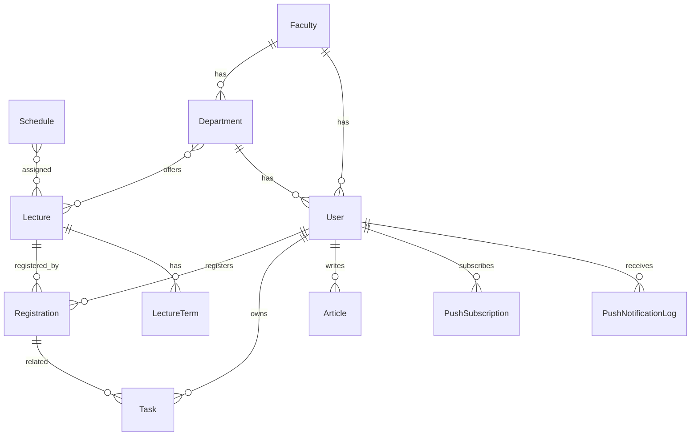

# ER Diagram

```mermaid
erDiagram
  User ||--o{ Registration : registers
  Lecture ||--o{ Registration : registered_by
  Lecture ||--o{ LectureTerm : has
  Schedule }o--o{ Lecture : assigned
  Department }o--o{ Lecture : offers
  User ||--o{ Task : owns
  Registration ||--o{ Task : related
  User ||--o{ Article : writes
  User ||--o{ PushSubscription : subscribes
  User ||--o{ PushNotificationLog : receives
  Faculty ||--o{ Department : has
  Faculty ||--o{ User : has
  Department ||--o{ User : has
```

## メモ

- 正式な定義は常に `prisma/schema.prisma` を優先する。
- 図がずれたらスキーマ更新時に追従して直す。
