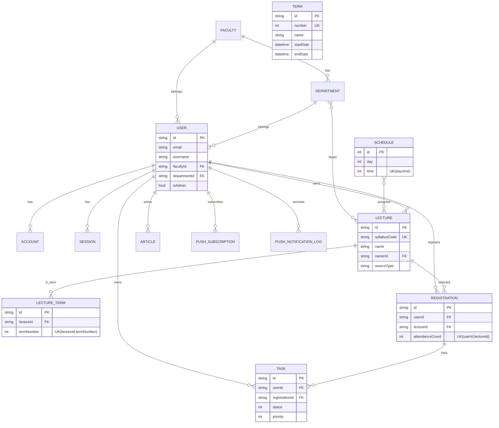

# Database Architecture

このドキュメントは、データベース設計をまとめたものです。  
実装は `prisma/schema.prisma` です。

## 命名規則

Prisma のモデル名・フィールド名は `camelCase` で統一する。

## 全体像

このアプリのDBは、以下5領域で構成されています。

1. 認証・ユーザー管理
2. 時間割・講義管理
3. タスク管理
4. 記事管理
5. プッシュ通知管理

## 設計上の重要方針

1. `Registration` は term 非依存

- `@@unique([userId, lectureId])`
- ターム再設定や期間変更があってもユーザー登録を維持するため

2. `Term` は 1〜4 の当年運用

- `Term.number` は 1〜4 を想定
- 過年度履歴は持たない前提

3. 講義の責務は `Lecture` に集約

- 小規模運用のため `Course/Offering` 分離は採用しない
- タームは `LectureTerm` 中間テーブルで管理し、`schedules` で曜日時限を表現する

4. 文字列フラグは enum 化

- `SourceType`, `NotificationType`, `NotificationStatus`

5. 講義の所有者は必須

- `Lecture.ownerId` は必須
- スクレイピング取り込み講義は運用上の管理者ユーザーを owner にする

## ドメイン別モデル

### 1. 認証・ユーザー管理

- `User`
- `Account`
- `Session`
- `VerificationToken`
- `Faculty`
- `Department`

役割:

- Auth.js (NextAuth) + Prisma Adapter の標準モデルを利用
- ユーザーのプロフィール情報、学部・学科を保持

### 2. 時間割・講義管理

- `Term`
- `Schedule`
- `Lecture`
- `LectureTerm`
- `Registration`

役割:

- `Schedule` は曜日×時限のマスタ
- `Lecture` は講義情報の主テーブル
- `Registration` はユーザーの受講登録状態

### 3. タスク管理

- `Task`

役割:

- ユーザー個人タスクを保持
- 必要に応じて `registrationId` で講義登録と紐付け

### 4. 記事管理

- `Article`

役割:

- ユーザー投稿記事の保存

### 5. プッシュ通知管理

- `PushSubscription`
- `PushNotificationLog`

役割:

- Web Push の購読先管理
- 通知送信ログの監査

## ER図（Mermaid）

## 主要な整合性ルール

1. 講義登録の重複禁止

- `Registration` は同一ユーザー・同一講義の重複を許可しない

2. 時間割マスタの重複禁止

- `Schedule` は同一の曜日・時限重複を許可しない

3. シラバスコードの一意性

- 大学由来講義は `Lecture.syllabusCode` で一意管理

4. 所有者整合性

- `Lecture.ownerId` は `User.id` を必ず参照

## 実装・運用メモ

1. スキーマ変更時

- `prisma/schema.prisma` を更新し `prisma migrate dev` を実行

2. シード投入時

- `prisma/seed.ts` 経由で `Term`, `Schedule`, `Lecture` 等を投入

3. 講義取り込み

- 管理画面の lecture import から `Lecture` を upsert
- 既存講義更新時も `syllabusCode` で同一講義として扱う

4. 参照の起点

- 画面実装では `Registration` を起点にユーザーの時間割状態を取得する
